# Sito web sulle console videoludiche - 'ConsoleVault'

Questo è un sito web creato con React e il framework Vite. Inoltre, per evitare il problema dello scope globale CSS e applicare stili ai componenti e ai tag JSX individualmente, è stato utilizzato il **framework CSS Tailwind con DaisyUi come plugin**. Il file `index.css` contiene stili generali che impediscono un'eccessiva ripetizione delle regole di Tailwind.

#### Nota sulle immagini

Le immagini delle console presenti in questo progetto raffigurano prodotti e marchi di proprietà di: ATARI, Panasonic, Nintendo, Sony e Microsoft. Tutti i diritti, inclusi copyright e marchi registrati, appartengono ai rispettivi proprietari. Le immagini sono utilizzate esclusivamente a scopo illustrativo e informativo.

Questo progetto NON è affiliato o approvato dalle aziende citate.

---

## Tecnologie e librerie utilizzate:

- **[React](https://reactjs.org/)** - Libreria per lo sviluppo dell'interfaccia utente.

- **[Vite](https://vitejs.dev/)** - Bundler veloce per sviluppo e build.

- **[Tailwind](https://tailwindcss.com/)** - Framework CSS.

- **[React Router](https://reactrouter.com/home)** - Dipendenza per il routing in una SPA.

- **[DaisyUI](https://daisyui.com/)** - Libreria di componenti dell'interfaccia utente basata su Tailwind.

---

**Struttura del progetto**:

- `./docs`: cartella con tutte le immagini del sito e gli screenshots di codice per il README.
- `./public`: cartella con il favicon.
- `./src/assets`: cartella con tutte le immagini dell'app.
- `./src/components`: cartella con tutti componenti dell'app.
- `./src/constants`: cartella con tutti gli array di oggetti utilizzati per mappare i componenti.
- `./src/pages`: cartella con tutte le pagine del sito.

<br />

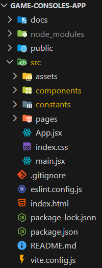

---

### Come avviare il progetto in locale

1. Assicurati di aver installato Node.js.
2. Apri il terminale:

```bash
git clone https://github.com/Edoardo-37/game-consoles-app
cd game-consoles-app (nome repository)
npm install (Per installare la cartella `node_modules`)
npm run dev
Apri il browser su http://localhost:5173
```

3. Per testare il sito sul tuo dispositivo mobile, vai al file `package.json` > oggetto `scripts` > chiave `dev` e digita `dev --host`, quindi riavvia il server con `npm run dev` e copia l'indirizzo mostrato.
4. Per arrestare il server, premi `CTRL + C`.

---

### Pagine principali del sito

1. **Pagina principale** con un'introduzione alla storia dell'industria videoludica.
2. Pagina dedicata alla storia delle **console Nintendo**.
3. Pagina dedicata alla storia delle **console Sony**.
4. Pagina dedicata alla storia delle **console Microsoft**.

- Tutte le pagine presentano lo stesso layout: una sidebar a sinistra che evidenzia i vari sottotitoli man mano che ci passiamo sopra grazie ad un Intersection Observer; e il contenuto a destra, tutto in una grande griglia da 2 colonne. Da mobile la sidebar sparisce e rimane solo il contenuto.
- Nelle diverse pagine persistono: il componente `<NavBar />`, `<Sidebar />` e `<Footer />`.

##### Pagina principale

- Contenuto principale della pagina gestito dal componente `<HomePageArticleBody />`.
- Componente `<Timeline />` preso da DaisyUI che accetta in ingresso informazioni provenienti da un'array di oggetti (presente nel file `./src/constants/homepageTimelineContent.jsx`) e stampa alternando i contenuti a destra e sinistra a seconda se l'id della key prop è pari o dispari.


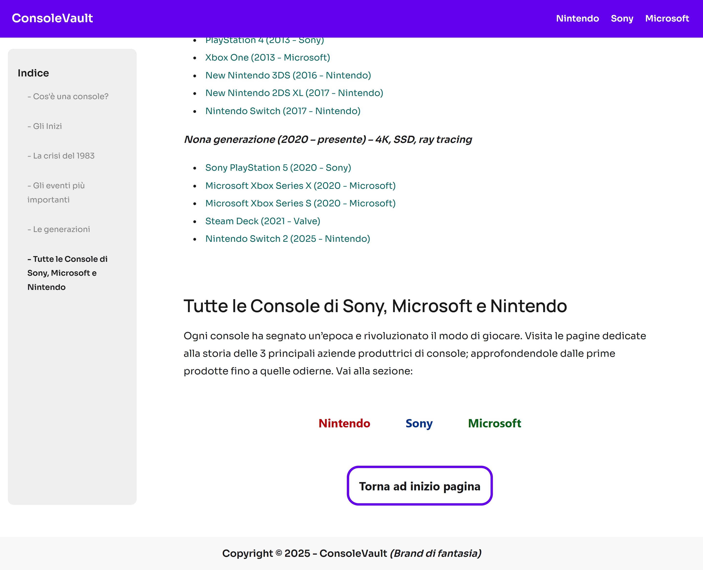

Componente `<Timeline />`

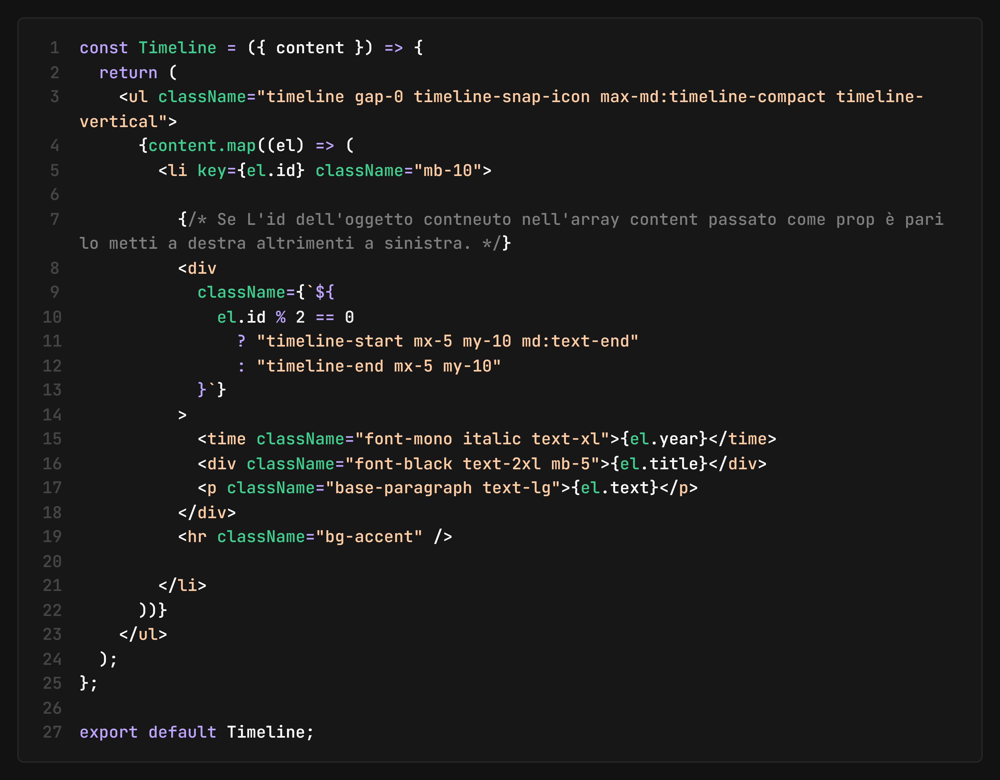

<br>

##### Pagina console Nintendo

- Struttura identica alla Pagina principale con un titolo, un'immagine di apertura e un'introduzione.
- Contenuto principale della pagina gestito dal componente `<SezioneConsole />`: a questo componente viene passata come prop l'array di oggetti `nintendoConsoles` che conterrà le informaizoni di tutte le console Nintendo (o della pagina di console che si sta visitando). Il componente restituisce un mapping dell'array per scorrere ognuno dei suoi elementi (ogni console) e stampa per ognuno il componente `<ConsoleCard />` al quale viene passata la key prop tramite id contenuto in ogni elemento dell'array di oggetti, e la prop consoleInfo che conterrà il singolo elemento dell'array che si sta mappando in quel momento.
  A questo punto il componente `<ConsoleCard />` fa una destrutturazione di tutte le proprietà dell'oggetto prop consoleInfo ricevuto e stampa un article con titolo, immagine, descrizione e, se esiste la proprietà `bestGamesList` nell'oggetto in quel momento mappato, una lista con i migliori giochi di quella specifica console. Per il codice JSX di tutto questo **[vai alla sezione Note tecniche e difficoltà riscontrate.](#note-tecniche--difficoltà-riscontrate)**


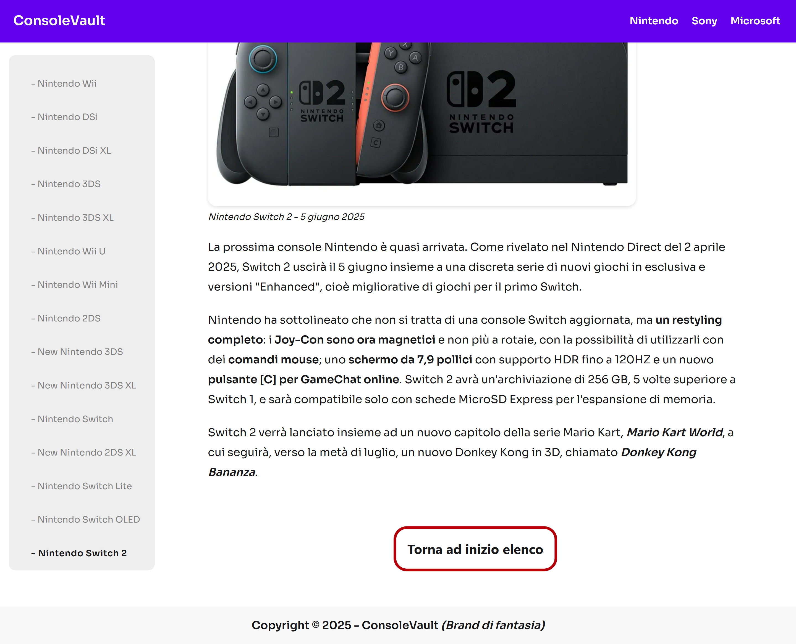
<br>

##### Pagina console Sony

- Struttura identica alla Pagina principale e quella relativa alle console Nintendo con un titolo, un'immagine di apertura, un'introduzione e l'elenco delle console gestito dal componente `<SezioneConsole />`. L'unico cambiamento è l'array di oggetti con le informazioni delle console passato a SezioneConsole, `sonyConsoles`.


<br>

##### Pagina console Microsoft

- Struttura identica alla Pagina principale e quella relativa alle console Nintendo e Sony. L'array di oggetti con le informazioni delle console è chiamato `microsoftConsoles`.


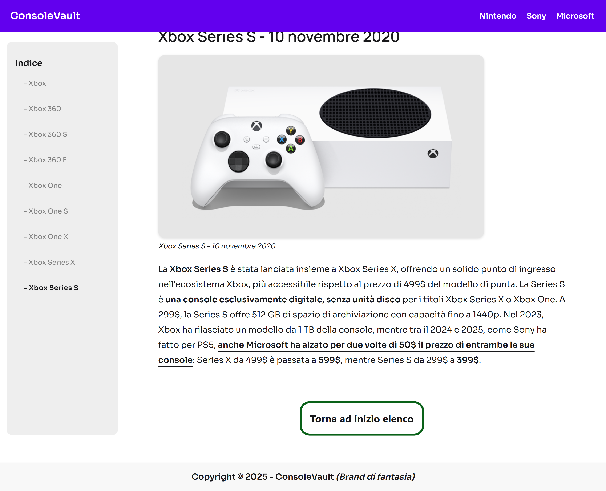

---

### CSS

- Layout a griglia e flessibili
- Design per dispositivi mobili
- Barra laterale (solo per schermi di grandi dimensioni) con link interni alle varie sezioni dell'articolo.
- Utilizzo del plugin DaisyUI per creare il controller per la Dark Mode: tramite il componente `<ThemeController />` si imposta l'icona e i nomi dei temi dai quali effettuare il cambio. In CSS si specificano i nomi dei temi e la palette colori da modificare.

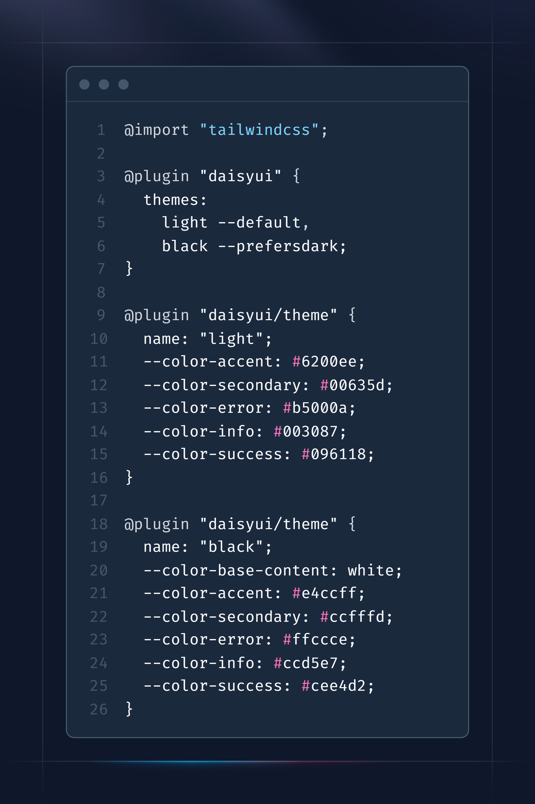

La dark mode si presenta così:

## 

### JavaScript

- Lazy Load delle immagini per migliori prestazioni gestite dal componente `<LazyImageObserver />`
- ##### Componente `<Sidebar />`
  Utilizzo di un secondo Intersection Observer, creato con un piccolo **aiuto dell'IA**, nel componente `<Sidebar />` per implementare il Lazy load e per applicare un font weight differente alle scritte della sidebar quando intercettiamo i titoli delle diverse sezioni della pagina. Di seguito il codice:

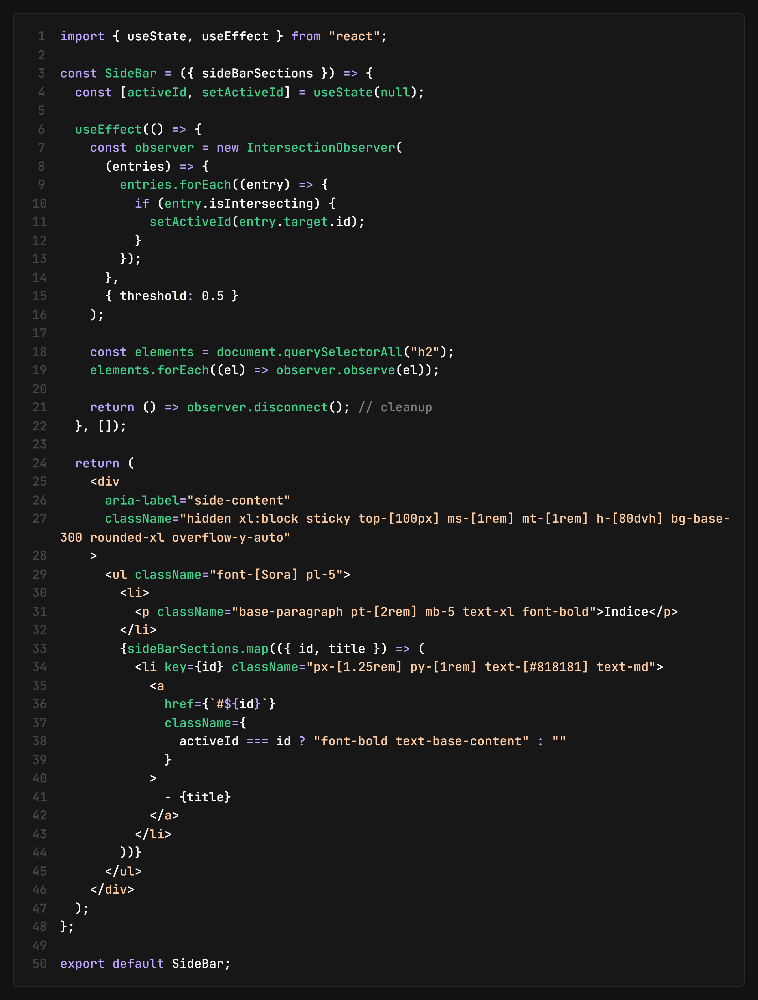

Vengono osservati tutti gli h2 della pagina e non appena si intercettano, la propreità `activeId` si setta con il valore dell'ID del sottotitolo intercettato. Poi il componente stampa a schermo un mapping dei vari titoli della sidebar ricevuti attraverso una prop `sidebarSections`. Questa prop è un array di oggetti ognuno contenente id e testo del titolo; (di seguito un esempio con l'array di oggetti sui titoli della sidebar della pagina principale).
Infine avviene il controllo: se l'id del titolo corrisponde a quello intercettato allora il colore e font weight del testo cambiano.


---

### Build per la produzione

Eseguire il comando: `npm run build`.
La cartella `/dist` conterrà tutti i file ottimizzati.

---

#### Note tecniche & Difficoltà riscontrate

1. Quando si cambiava rotta, tramite il package npm `react-router`, notavo che lo scroll della pagina non tornava all'inizio bensì rimaneva in un punto della pagina casuale a seconda della sua lunghezza. **Per risolvere** ho creato il componente `<ScrollToTop />` che utilizza l'hook useLocation per destrutturare la proprietà pathname che ha come valore il path della pagina in cui si è in quel momento.
   Poi ho inserito uno useEffect che, al variare del pathname (messo nell'array delle dipendenze), facesse tornare le coordinate dello scroll a 0, 0.

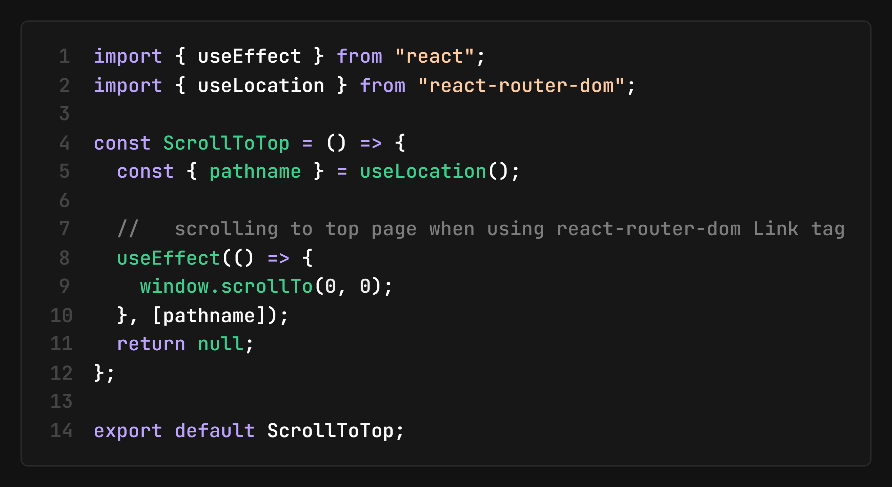

2. Ogni console mostrata sulle pagine di Nintendo, Sony e Microsoft è generata partendo da un array di oggetti contente le informazioni (ed eventuali liste di alcuni dei migliori giochi usciti). Questo array, chiamato `nintendoConsoles` nel caso delle console Nintendo e così via, viene passato come prop al componente `<SezioneConsole />`: questo componente scorre l'array con la proprietà map e per ogni elemento (il singolo gioco), stampa una `<ConsoleCard />`. ConsoleCard stamperà un mini article con dentro, un titolo, immagine, caption dell'immagine, paragrafi, ed eventuali liste di giochi. Di seguito le immagini:

Array di oggetti delle console - `nintendoConsoles`

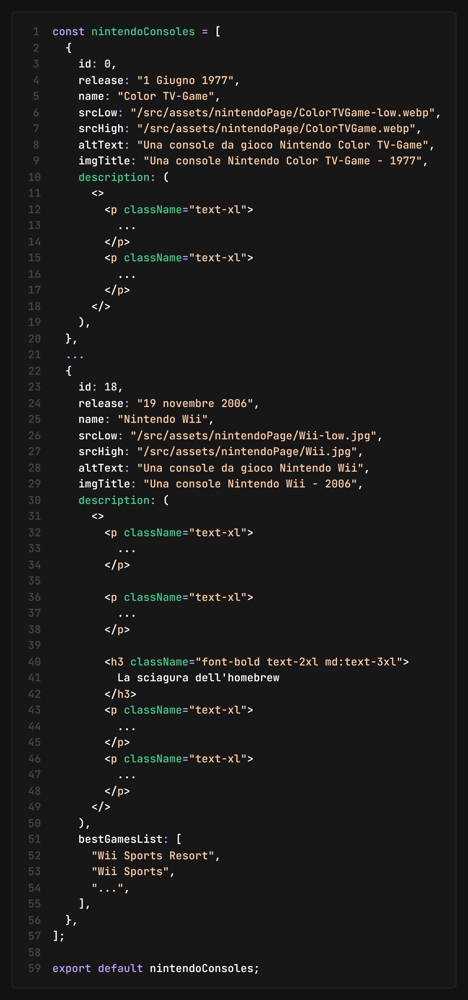

Componente `<SezioneConsole />`

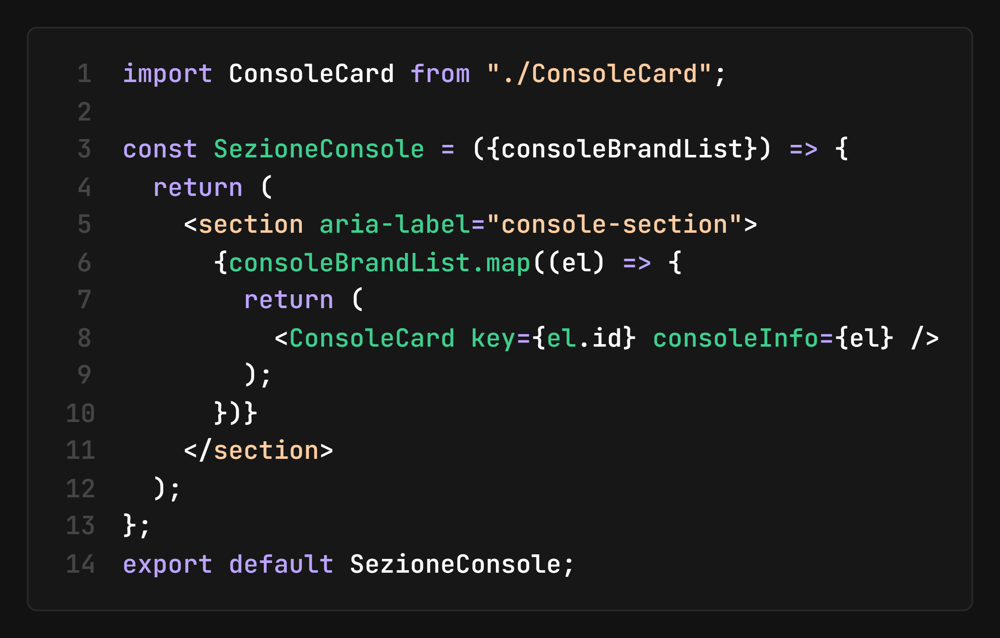

Componente `<ConsoleCard />`

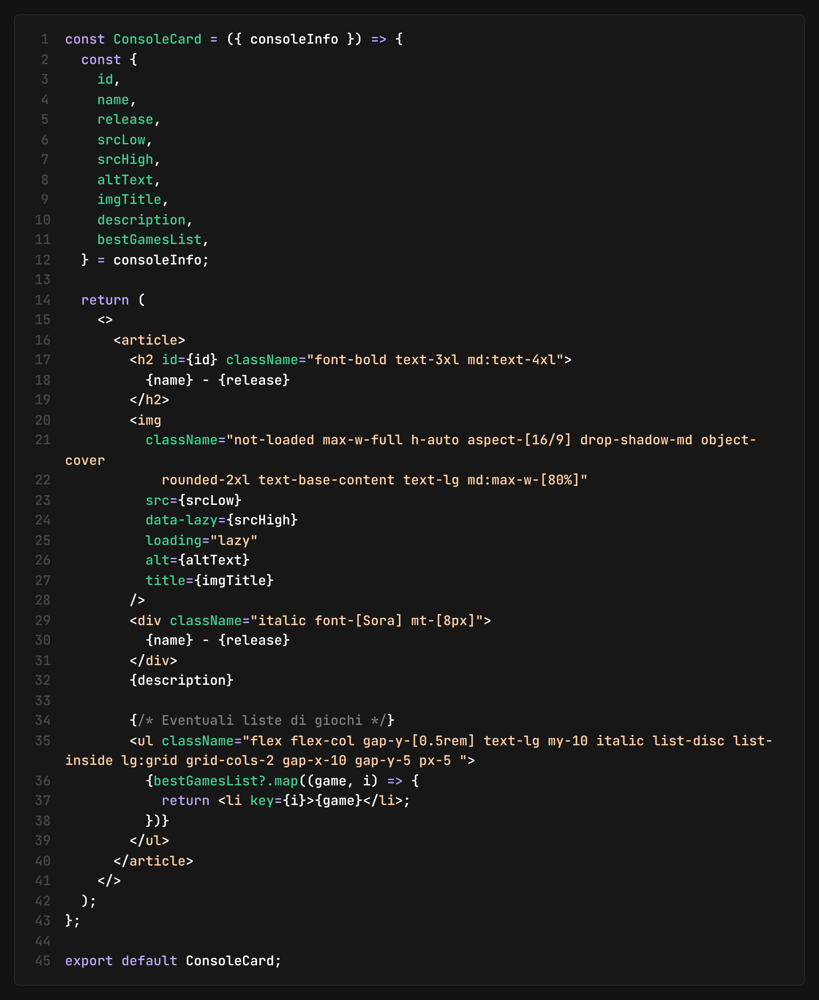

2. Come si applica tutto questo nelle pagine? Nella pagina `Nintendo.jsx`, ad esempio si importa l'array di oggetti e il componente `<SezioneConsole />` e lo si dichiara passando come prop l'array di oggetti `nintendoConsoles` e così via per la pagina per le console Sony e Microsoft. Di seguito l'esempio della pagina Nintendo.jsx.

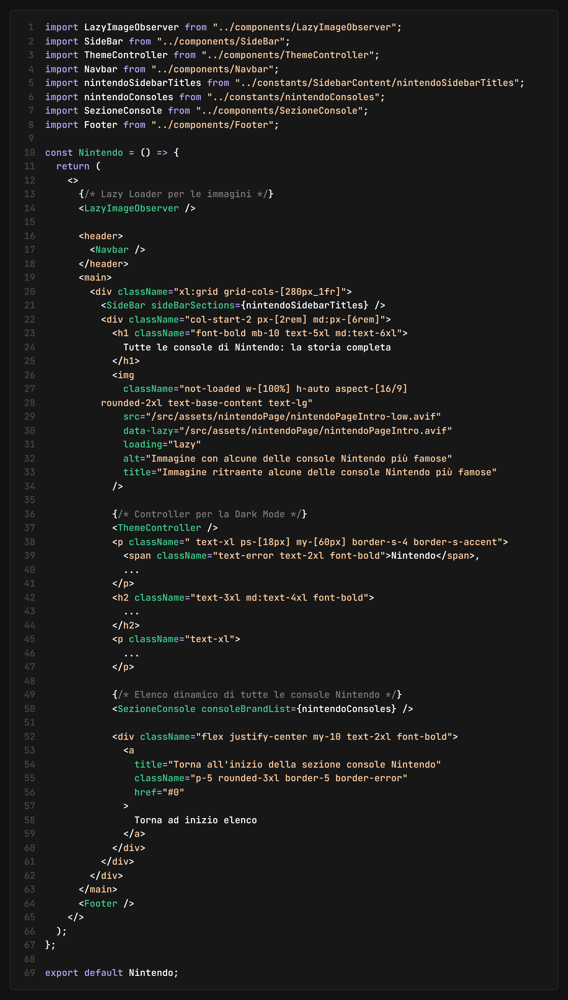
